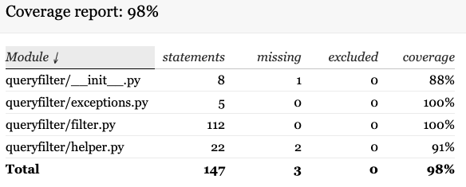

# Queryfilter

Queryfilter is a small ORM to read arguments URL and make SQL
query

### TO Install

> pip install git+git@github.com:hurusystems/sqlalchemy-queryfilter.git

### HOW TO USE

```python
from queryfilter import query_manager, json_response

so_schema = MyModelSchema(many=True)


def view(request):
    qs = query_manager(arguments=request.args, model=MyModel)
    results = so_schema.dump(orders)

    # default content for datatables js
    return json_response(qs, results)
```
### Filters

By default queryfilter will check if ModelField has filter implemented by SQLAlchemy,
if not they will search in commum filter

(available filters)
- **notin_**: default filter used with SQLAlchemy
- **lte**: Lower than Equal
- **gte**: Greater than Equal
- **like**: default filter used with SQLAlchemy
- **ilike**: default filter used with SQLAlchemy
- **gt**: Greater than
- **lt**: Lower than
- **month**: Filter (date, datetime, timestamp) by month
- **year**: Filter (date, datetime, timestamp) by year
- **equal**: default filter used with SQLAlchemy
- **is_**: default filter used with SQLAlchemy
- **isnot**: default filter used with SQLAlchemy
- **in_**: default filter used with SQLAlchemy
- **any**: default filter used with SQLAlchemy

##### All possible filter

-> https://docs.sqlalchemy.org/en/13/orm/internals.html?highlight=notin_#sqlalchemy.orm.attributes.QueryableAttribute

### Coverage


